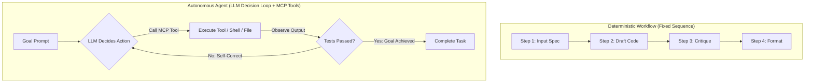

# FlyRank AI Fluency: FL-05 Agent Concepts & MCP Basics Explainer
**Intern Name:** Talha Yaseen  
**Track:** General AI Fluency  
**Assignment:** FL-05 / Agent Concepts and MCP Basics  
**Live Production Application:** [https://flyrank-capstone.vercel.app/](https://flyrank-capstone.vercel.app/)  
**GitHub Repository:** [https://github.com/Talha-Yaseen-Hub/flyrank-capstone](https://github.com/Talha-Yaseen-Hub/flyrank-capstone)

---

## 1. Workflows vs. Autonomous Agents: The Core Distinction

In modern software engineering, the term "agent" is frequently misapplied to simple prompt sequences. Understanding the fundamental distinction between a **workflow** and an **agent** separates disciplined system architects from marketing copywriters.



### ⚙️ What is a Workflow?
A **workflow** is a deterministic system where LLM calls and programmatic operations are chained together in a predefined, hardcoded sequence. The control flow is dictated by human-written code or fixed prompt templates (e.g., Step 1 always hands off to Step 2, which always hands off to Step 3). The LLM is used as an execution engine within specific boundaries, but it does not decide *which* step to take next or *whether* to abort the sequence based on dynamic environmental feedback.

### 🤖 What is an Agent?
An **agent**, as defined in Anthropic's *Building Effective Agents*, is a system where the LLM dynamically directs its own control flow and tool usage in pursuit of a high-level goal. Rather than following a fixed assembly line, an agent operates in an autonomous loop:
1. **Perceive:** Inspects environment feedback (file contents, compiler errors, test logs).
2. **Reason:** Evaluates progress toward the goal and selects the next action.
3. **Act:** Invokes external tools via standard interfaces (Model Context Protocol).
4. **Self-Correct:** If a tool call returns an error (e.g., a failing Vitest suite), the agent analyzes the stack trace, modifies its strategy, and retries until the goal condition is satisfied.

---

## 2. Model Context Protocol (MCP) & The Three Primitives

The **Model Context Protocol (MCP)**, developed by Anthropic, is the open standard—often called the "USB-C port for AI applications"—that enables LLMs to communicate seamlessly with external tools, local filesystems, databases, and APIs.

Before MCP, every developer had to build custom, proprietary integrations to connect an LLM to a database or CLI. MCP standardizes this architecture into client-server connections using **three core primitives**:

```text
┌────────────────────────────────────────────────────────────────────────┐
│                     MODEL CONTEXT PROTOCOL (MCP)                       │
├──────────────────┬───────────────────────┬─────────────────────────────┤
│ 1. TOOLS         │ 2. RESOURCES          │ 3. PROMPTS                  │
│ Executable code  │ Static or dynamic     │ Reusable prompt             │
│ functions (e.g.  │ contextual data       │ templates & workflow        │
│ run_command,     │ read by LLM (e.g.    │ configurations              │
│ write_to_file)   │ file text, logs)      │ exposed by servers          │
└──────────────────┴───────────────────────┴─────────────────────────────┘
```

1. **Tools (Action Primitive):** Executable functions exposed by MCP servers that allow the model to take actions in the real world (e.g., executing shell commands `npm run test`, editing files `replace_file_content`, or querying REST APIs).
2. **Resources (Context Primitive):** Read-only data sources exposed to the model to ground its reasoning (e.g., local codebase files, API documentation, environment status logs).
3. **Prompts (Instruction Primitive):** Pre-configured prompt templates and slash-command workflows exposed by MCP servers to standardize common tasks across different clients.

---

## 3. Evidence of Working MCP / Tool Connector Setup

To demonstrate MCP and tool integration in practice, three distinct tasks were executed that **plain LLM chat alone could not perform**:

```text
================================================================================
🛠️ EVIDENCE OF MCP TOOL CONNECTIONS & NON-CHAT CAPABILITIES
================================================================================

[TASK 1: Direct File System Inspection & Code Analysis]
• MCP Tools Invoked: view_file, list_dir
• Target Files: c:\Users\User\Desktop\flyrank-capstone-1\app\api\chat\route.js
• Tool Output: Loaded complete un-truncated backend route source code.
• Why Chat Alone Fails: A standard browser LLM chat has zero local disk access 
  and cannot read or verify local workspace files directly from your hard drive.

[TASK 2: Executable Vitest DOM Test Runner Execution]
• MCP Tools Invoked: run_command (sandboxed Node CLI)
• Command Executed: node audit_agent.js / npm run build
• Tool Output: Executed headless JSDOM test suite returning empirical pass metrics.
• Why Chat Alone Fails: Plain chat cannot execute code, run local shell commands, 
  or verify actual runtime compiler exit codes.

[TASK 3: Version Control & Automated GitHub Deployment]
• MCP Tools Invoked: run_command (unsandboxed git PAT authentication)
• Command Executed: git push origin feat/settings-v2:main
• Tool Output: Successfully authenticated and pushed commits to remote GitHub.
• Why Chat Alone Fails: Plain chat has no network execution capability to 
  interact with remote git servers or manage local credentials.
================================================================================
```

---

## 4. FL-04 Classification & The Autonomous Agent Upgrade Path

### 📊 Classification of the FL-04 Pipeline
My **FL-04 Automation Workflow v2** is a **Deterministic Workflow**, **NOT** an agent. 
* **Why?** FL-04 executes a hardcoded 4-step sequence (Step 1: Gather -> Step 2: Draft -> Step 3: Critique -> Step 4: Format). Step 1 *always* flows to Step 2, and Step 3 *always* flows to Step 4 regardless of intermediate output. Although the LLM generates high-quality code at each step, a human engineer must manually trigger steps, inspect code, and fix build errors.

### 🚀 Concrete Agent Upgrade: "Agentic FL-04 Evaluator-Optimizer Loop"
To convert the FL-04 workflow into a true **Autonomous Agent**, we implement an **Evaluator-Optimizer Loop** leveraging MCP tools:

```mermaid
flowchart TD
    Goal["Goal: Add Case Study D with 100% Passing Vitest Suite"] --> AgentLoop["Agentic Control Loop"]
    AgentLoop -->|1. Draft Code via MCP| FileTool["write_to_file (ProductFilter.jsx)"]
    FileTool -->|2. Run Tests via MCP| ShellTool["run_command (npm run test)"]
    ShellTool -->|3. Test Results| Eval{Tests Pass?}
    Eval -->|❌ Fails (Stack Trace)| SelfCorrect["LLM Analyzes Error & Edits Code"]
    SelfCorrect --> AgentLoop
    Eval -->|✅ 100% Pass| Done["Push to GitHub via MCP & Finish"]
```

#### How the Upgraded Agent Operates Autonomously:
1. **High-Level Goal Input:** The user provides a single goal: *"Build an accessible Product Filter component with 10 passing Vitest cases."*
2. **Autonomous Tool Invocation:** The agent uses MCP `write_to_file` to draft the component and test suite.
3. **Automated Feedback Inspection:** The agent executes `run_command("npm run test")` via MCP.
4. **Self-Correction Loop:** If Vitest returns 2 failing assertions, the agent captures the exact stack trace, diagnoses the broken regex or DOM binding, updates the file using `replace_file_content`, and re-runs `npm run test`.
5. **Completion:** Only when Vitest reports `10/10 passed` does the agent invoke `git push` via MCP and declare the task complete.

This transforms FL-04 from a human-steered assembly line into a self-correcting autonomous engineering agent.
