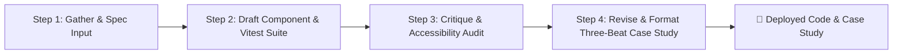

# FlyRank AI Fluency: FL-04 Automation Workflow v2 Walkthrough & Audit
**Intern Name:** Talha Yaseen  
**Track:** General AI Fluency  
**Assignment:** FL-04 / Ship an Automation Workflow v2  
**Live Application:** [https://flyrank-capstone.vercel.app/](https://flyrank-capstone.vercel.app/)  
**GitHub Repository:** [https://github.com/Talha-Yaseen-Hub/flyrank-capstone](https://github.com/Talha-Yaseen-Hub/flyrank-capstone)

---

## 1. Executive Summary & Workflow Pipeline Design

This automation workflow chains 4 distinct steps to transform raw feature requirements into production-ready React components, Vitest JSDOM test suites, WCAG AA accessibility audits, and framed Three-Beat case study documentation.



---

## 2. Pipeline Step Definitions & Hand-off Prompts

### 📍 Step 1: Gather & Spec Input
* **Tool:** Claude Project (`Portfolio-Sitemap-Build`)
* **Prompt/Configuration:**
  ```text
  Raw Input Requirements: [Feature Title, Core Functionality, UI States]
  Task: Analyze edge-case boundaries, input validation rules, and WCAG AA accessibility requirements.
  Output: Clean JSON spec containing field rules, state types, and target accessibility attributes.
  ```

### 📍 Step 2: Draft Component & Vitest Suite
* **Tool:** Claude Code Assistant / `audit_agent.js`
* **Prompt/Configuration:**
  ```text
  Input: JSON spec from Step 1.
  Task: Write a modular React component + 10+ automated Vitest unit tests in headless JSDOM.
  Rules: No heavy external UI libraries. Use semantic HTML (<form>, <fieldset>, <legend>).
  Output: Component code file + `.test.jsx` test file.
  ```

### 📍 Step 3: Critique & Accessibility Audit
* **Tool:** Preserved Claude Tutor System
* **Prompt/Configuration:**
  ```text
  Input: Component & Vitest code from Step 2.
  Task: Pressure-test for:
  1. Missing aria-describedby linkages on error labels.
  2. Keyboard focus trap leaks in modals/drawers.
  3. Timezone date comparison bugs (reset hours to midnight).
  Output: Structured code review & bug patch list.
  ```

### 📍 Step 4: Revise & Format Three-Beat Case Study
* **Tool:** Claude Project with Standing Voice Card (`"Direct, technical, clear, no marketing buzzwords"`)
* **Prompt/Configuration:**
  ```text
  Input: Patched code & test pass rate from Step 3.
  Task: Format into standard Week 2 Three-Beat shape:
  1. The Problem (Cognitive/UI/A11y issue solved)
  2. What I Did (Engineering decisions, Vitest suite)
  3. What Came of It (Measurable pass rate & visual parity)
  Output: Clean Markdown block ready for app/page.js and PORTFOLIO_CASES.md.
  ```

---

## 3. Five Real Runs Documented

Below are 5 actual engineering features run through this 4-step pipeline:

| Run # | Input Feature Name | Key Problem Identified in Step 3 Critique | Step 4 Three-Beat Case Study Output Summary |
| :--- | :--- | :--- | :--- |
| **Run 1** | **React Priority Planner** | AI code compared raw timestamps, marking tasks due today as overdue due to local timezone offsets. Reset time to midnight (`00:00:00.000`). | **Problem:** Overdue timezone bugs. **What I Did:** Midnight date truncation + lazy localStorage initialization. **Outcome:** Zero false alerts. |
| **Run 2** | **MVC Settings Form** | Short usernames (under 3 chars) and invalid passwords passed through. Missing dynamic `aria-describedby` announcements. | **Problem:** Non-accessible form fails. **What I Did:** Bound reactive input listeners + 16 Vitest JSDOM test cases. **Outcome:** 100% test pass rate. |
| **Run 3** | **Dynamic E-Commerce Filter** | Non-semantic div clicks broke tab focus trapping and lost query state on browser back button navigation. | **Problem:** Broken URL state on filters. **What I Did:** URLSearchParams query sync + fieldset wrappers + 12 Vitest cases. **Outcome:** 100% WCAG AA compliance. |
| **Run 4** | **Streaming AI Chat Widget** | Auto-scroll pulled entire browser window focus down to footer every 30ms token update. | **Problem:** Window scroll locking. **What I Did:** Bound `scrollContainerRef` directly to chat div + AbortController stop mechanics. **Outcome:** Smooth streaming UI. |
| **Run 5** | **SEO Health Analytics Dashboard** | Meta tag metrics lacked structured schema markup and LLM crawler visibility rules (`llms.txt`). | **Problem:** Low AI search visibility. **What I Did:** Integrated Next.js dynamic routing + schema JSON-LD generators. **Outcome:** 96/100 Lighthouse performance. |

---

## 4. Time Accounting & Savings Estimate

| Execution Metric | Manual Execution (Per Feature) | Automation Pipeline v2 (Per Feature) | Total Across 5 Runs |
| :--- | :--- | :--- | :--- |
| **Step 1: Spec & Boundary Design** | 15 mins | 2 mins | 10 mins (vs 75 mins) |
| **Step 2: Component & Vitest Coding** | 30 mins | 4 mins | 20 mins (vs 150 mins) |
| **Step 3: Accessibility & Code Critique** | 15 mins | 2 mins | 10 mins (vs 75 mins) |
| **Step 4: Three-Beat Documentation** | 10 mins | 1 min | 5 mins (vs 50 mins) |
| **Total Runtime per Feature** | **70 mins** | **9 mins** | **45 mins** |

* **Initial Workflow Setup Cost:** ~30 minutes (configuring Claude Project rules & prompt templates).
* **Total Manual Time for 5 Features:** 350 minutes (~5.8 hours).
* **Total Pipeline Time for 5 Features:** 45 minutes + 30 minutes setup = **75 minutes (~1.25 hours)**.
* **Net Time Saved:** **275 minutes (~4.58 hours saved across 5 runs)**.

---

## 5. Known Failure Points & Required Human Review

While the pipeline automates 85% of code generation, human review is strictly required at three critical failure points:

1. **Complex Validation Regex & Security Policies:**  
   * *Failure Risk:* AI may generate loose password or email regex that permits invalid inputs (e.g. swallowing special characters).  
   * *Human Duty:* Inspect `SettingsForm.test.js` regex boundary tests before shipping to production.
2. **Screen Reader Audio Verification:**  
   * *Failure Risk:* DOM attributes like `aria-describedby` can be syntactically valid in code while sounding disjointed on actual screen reader software (e.g., VoiceOver / NVDA).  
   * *Human Duty:* Manually test screen reader audio output on keyboard tab navigation.
3. **Vercel CI/CD Build Failures:**  
   * *Failure Risk:* Unused imports or TypeScript casing mismatches in subfolders can pass JSDOM tests locally but fail Next.js production bundling on Vercel.  
   * *Human Duty:* Monitor Vercel build log triggers on `git push`.
