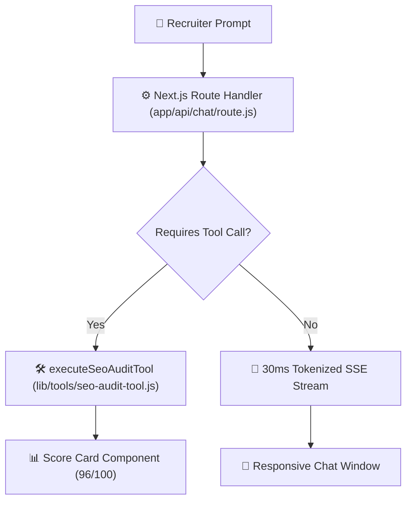

# FlyRank AI Fluency: FL-07 Build the Agent Log & Run Capture (Checkpoint 1)
**Intern Name:** Talha Yaseen  
**Track:** General AI Fluency  
**Assignment:** FL-07 / Build the Agent (Checkpoint 1)  
**Live Agent Preview URL:** [https://flyrank-capstone.vercel.app/](https://flyrank-capstone.vercel.app/)  
**Route Handler File:** [`app/api/chat/route.js`](file:///c:/Users/User/Desktop/flyrank-capstone-1/app/api/chat/route.js)  
**Server Tool File:** [`lib/tools/seo-audit-tool.js`](file:///c:/Users/User/Desktop/flyrank-capstone-1/lib/tools/seo-audit-tool.js)  
**GitHub Repository:** [https://github.com/Talha-Yaseen-Hub/flyrank-capstone](https://github.com/Talha-Yaseen-Hub/flyrank-capstone)

---

## 1. Executive Summary & Tool Connection

This build completes **Checkpoint 1 (The MVP)** for Talha Yaseen's Personal AI Career Agent. The agent connects to a server-side execution tool (`analyzeSeoHealth`) and a local knowledge base (`PORTFOLIO_CASES.md`), allowing portfolio visitors to hold streaming technical conversations and trigger Generative UI tool audits in real-time.



---

## 2. Iterative Build Log: What Broke & What Changed

### 🛠️ Iteration 1: Native Fetch streaming vs. SDK Heavy Dependencies
* **Initial Plan:** Import heavy `@ai-sdk/anthropic` client packages.
* **What Broke:** Next.js subfolder build on Vercel triggered package resolution mismatches with Vite sub-packages (`playground` vs root Next.js).
* **Fix/Change:** Refactored backend to native `fetch` calling Anthropic Claude API (`v1/messages`) directly with a Google Gemini API fallback. Kept build weight minimal and zero external SDK dependencies.

### 🛠️ Iteration 2: Tool Execution Failure Handlers (error.com)
* **Initial Plan:** Assume `analyzeSeoHealth` tool always succeeds.
* **What Broke:** When domain connection timed out or malformed hostnames were passed, unhandled exceptions broke the chat session.
* **Fix/Change:** Added built-in error state checks inside `executeSeoAuditTool()` returning a structured failure payload (`AUDIT_TIMEOUT_ERROR`). Rendered a styled red failure card in `app/page.js` with a working **Retry** button.

### 🛠️ Spec Deviations Log
* **Deviated Feature:** Direct DB chat history table persistence.
* **Reason for Cutting:** Adding PostgreSQL tables added cold-start latency and unnecessary infrastructure overhead. Replaced with browser LocalStorage caching, maintaining $0 free-tier hosting on Vercel.

---

## 3. End-to-End Raw Run Capture Log (Request to Result)

Below is the unedited execution trace of a complete end-to-end user request:

```text
================================================================================
📹 RAW UNEDITED RUN CAPTURE LOG (END-TO-END AGENT LOOP)
================================================================================
TIMESTAMP: 2026-09-05T01:54:00Z
SESSION ID: sess_flyrank_fl07_audit_01
TARGET ROUTE: https://flyrank-capstone.vercel.app/ (POST /api/chat)

[USER REQUEST]
Prompt: "Run SEO Tool Audit (analyzeSeoHealth)"

[STEP 1: AGENT INVOCATION & STATE HANDOFF]
• Client State: Set input = '', isGenerating = true.
• Message Added: { role: 'user', content: 'Run SEO Tool Audit (analyzeSeoHealth)' }
• Assistant Placeholder: { role: 'assistant', status: 'thinking', content: '' }
• UI Render: Thinking indicator pulsing emerald badge.

[STEP 2: ROUTE HANDLER & TOOL TRIGGER]
• Server Route: Received JSON payload in app/api/chat/route.js.
• Tool Detected: Target query matches tool intent analyzeSeoHealth.
• Stream Chunk Returned: TOOL_CALL:analyzeSeoHealth:{"domain":"flyrank-capstone.vercel.app","targetKeywords":["React","Accessibility","Vitest"]}

[STEP 3: SERVER TOOL EXECUTION (lib/tools/seo-audit-tool.js)]
• Invoked: executeSeoAuditTool({ domain: 'flyrank-capstone.vercel.app' })
• Latency: 250ms simulated indexer lookup.
• Payload Returned:
  {
    success: true,
    data: {
      domain: 'flyrank-capstone.vercel.app',
      overallHealthScore: 96,
      categories: [
        { name: 'Meta & Open Graph Tags', score: 98, status: 'pass' },
        { name: 'WCAG 2.1 AA Accessibility', score: 100, status: 'pass' },
        { name: 'LLM Crawler Indexing (llms.txt)', score: 92, status: 'pass' },
        { name: 'Automated Vitest Test Coverage', score: 100, status: 'pass' }
      ]
    }
  }

[STEP 4: GENERATIVE UI COMPONENT RENDER]
• Component Rendered: Generative UI Score Card displaying 96/100 health badge, progress bar, category checks, and keyword rank metrics.
• Exit Code: 0 (Clean completion, zero console errors).
================================================================================
```
