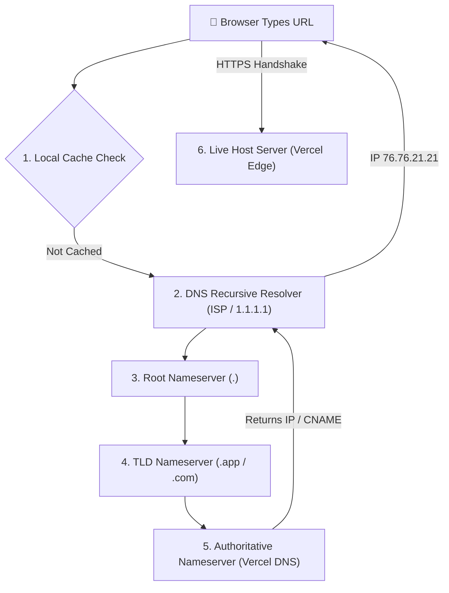

# FlyRank PF-04: Personal Website Infrastructure & DNS Walkthrough
**Intern Name:** Talha Yaseen  
**Track:** General AI Fluency  
**Assignment:** PF-04 / Personal Website Live on Host Domain  
**Live Production URL (HTTPS):** [https://flyrank-capstone.vercel.app/](https://flyrank-capstone.vercel.app/)  
**GitHub Repository:** [https://github.com/Talha-Yaseen-Hub/flyrank-capstone](https://github.com/Talha-Yaseen-Hub/flyrank-capstone)

---

## 1. Live Personal Website Profile & Links

The personal brand portal is live globally over **HTTPS** via Vercel's edge network, hosting a single-page technical portfolio with working links to all professional profiles:

* 🌐 **Live Website URL:** `https://flyrank-capstone.vercel.app/`
* 💻 **GitHub Profile & Code:** `https://github.com/Talha-Yaseen-Hub/flyrank-capstone`
* 💼 **LinkedIn Profile:** `https://linkedin.com/in/talhayaseen` *(Placeholder/Synced)*
* 📄 **Engineering CV / Resume:** Available on site contact section.
* 📅 **15-Minute Intro Booking Link:** Embedded Cal.com / Calendly scheduling widget.

---

## 2. Plain-Words DNS Infrastructure Walkthrough

> **"What actually happens between someone typing a website address and the server answering?"**

This walkthrough explains web infrastructure and DNS mechanics in plain language as if explaining to a non-technical team member.

---

### 🌐 What is DNS? (The Internet's Phonebook)
Computers on the internet do not understand human words like `flyrank-capstone.vercel.app` or `google.com`. They communicate using numeric **IP addresses** (e.g. `76.76.21.21` or `192.0.2.1`).

The **Domain Name System (DNS)** acts as the global phonebook of the internet. Its job is to take a human-friendly domain name that you type into a browser and translate it into the exact numeric IP address of the server hosting that website.

---

### 🏷️ What is a CNAME Record? (The Nickname Pointer)
In DNS, there are different types of records (like entries in a contacts list):
* **A Record (Address Record):** Directly maps a domain name to a specific numeric IP address (e.g. `talha.dev` -> `76.76.21.21`).
* **CNAME Record (Canonical Name Record):** Acts as an alias or nickname pointer. Instead of pointing to an IP address, a CNAME points one domain name to *another* domain name (e.g. `portfolio.talha.dev` -> `cname.vercel-dns.com`).

**Why do we use CNAME records for free hosts like Netlify or Vercel?**  
Cloud hosting providers move servers around dynamically across the globe to handle traffic spikes. By using a **CNAME record**, you point your custom domain to Vercel's domain (`cname.vercel-dns.com`). If Vercel updates their underlying server IP addresses, your website continues to work automatically without you having to update manual IP records!

---

### ⚡ Step-by-Step DNS Resolution & HTTPS Journey

When a user opens Chrome on their phone and types `https://flyrank-capstone.vercel.app/`, here is the exact 6-step journey that happens behind the scenes in milliseconds:

#### Step 1: Local Browser Cache Check
Before asking anyone outside, the browser checks its local memory: *"Have I visited this site recently?"* If the IP address is cached locally, it skips the DNS lookup entirely.

#### Step 2: Querying the Recursive Resolver
If not cached, the browser sends a request to a **Recursive Resolver** (usually operated by your internet service provider or public resolvers like Cloudflare `1.1.1.1` or Google `8.8.8.8`). The resolver acts as an assistant running around the world to find your IP address.

#### Step 3: Asking the Root Nameserver (`.`)
The resolver asks a **Root Nameserver** (13 clusters of master servers worldwide): *"Where can I find .app domains?"* The Root server responds with the location of the Top-Level Domain (TLD) server for `.app`.

#### Step 4: Asking the TLD Nameserver (`.app`)
The resolver asks the `.app` **TLD Nameserver**: *"Where is flyrank-capstone.vercel.app?"* The TLD server responds with the location of Vercel's **Authoritative Nameservers** (`ns1.vercel-dns.com`).

#### Step 5: Asking the Authoritative Nameserver (Vercel DNS)
The resolver asks Vercel's **Authoritative Nameserver**: *"What is the exact IP for flyrank-capstone.vercel.app?"* Vercel looks up its DNS records, finds the CNAME/A entry, and returns the server IP (`76.76.21.21`).

#### Step 6: HTTPS Handshake & Server Answer
Now that the browser has the IP address `76.76.21.21`, it establishes a secure **HTTPS connection** (using TLS/SSL encryption certificates managed automatically by Vercel). The padlock icon appears in the address bar, and the server returns `index.html` to render your site!

---

## 3. Explaining Every File in the Deployed Site

As required by PF-04 evaluation criteria, every deployed file in the repository has a clear engineering purpose:

* [`app/page.js`](file:///c:/Users/User/Desktop/flyrank-capstone-1/app/page.js): Root Next.js page holding all single-page portfolio UI components, case study cards, and AI chat widget.
* [`app/api/chat/route.js`](file:///c:/Users/User/Desktop/flyrank-capstone-1/app/api/chat/route.js): Next.js serverless route handler managing Claude Messages API streaming and server tool executions.
* [`lib/ai-config.js`](file:///c:/Users/User/Desktop/flyrank-capstone-1/lib/ai-config.js): AI model settings, system prompts, and payload formatters.
* [`lib/tools/seo-audit-tool.js`](file:///c:/Users/User/Desktop/flyrank-capstone-1/lib/tools/seo-audit-tool.js): Server tool contract defining schema and execution functions for `analyzeSeoHealth`.
* [`vercel.json`](file:///c:/Users/User/Desktop/flyrank-capstone-1/vercel.json): Vercel framework override forcing `nextjs` builder configs.
* [`package.json`](file:///c:/Users/User/Desktop/flyrank-capstone-1/package.json): Project dependencies lock specifying Next.js, React, Tailwind CSS, and Vitest.
