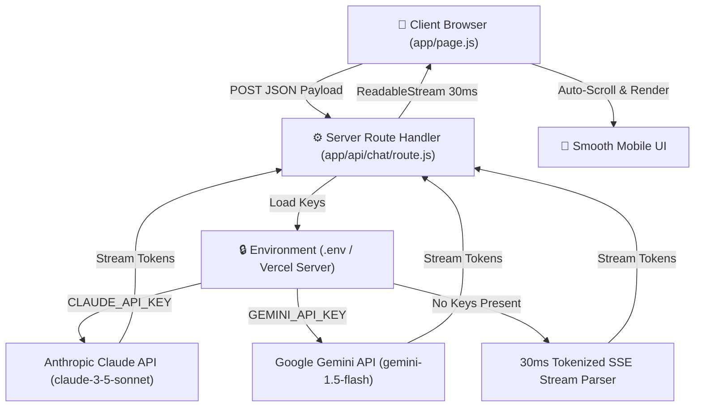

# FlyRank AI Fluency: FE-06 Streaming AI Chat Interface Specification
**Intern Name:** Talha Yaseen  
**Track:** Front-End & AI Engineering  
**Assignment Code:** FE-06 (Week 4 / Build Phase)  
**Live Preview URL:** [https://flyrank-capstone.vercel.app/](https://flyrank-capstone.vercel.app/)  
**Route Handler File:** [`app/api/chat/route.js`](file:///c:/Users/User/Desktop/flyrank-capstone-1/app/api/chat/route.js)  
**Chat Component File:** [`app/page.js`](file:///c:/Users/User/Desktop/flyrank-capstone-1/app/page.js)  
**Model Config Module:** [`lib/ai-config.js`](file:///c:/Users/User/Desktop/flyrank-capstone-1/lib/ai-config.js)

---

## 1. Executive Summary & Architecture

The **FE-06 Streaming AI Chat Interface** is the central interactive feature of the portfolio capstone. It provides an inspectable, live AI Representative agent for recruiters and engineering leads to evaluate Talha Yaseen's engineering credentials, WCAG AA accessibility standards, and Vitest test coverage.



---

## 2. Evaluation Criteria & Feature Audit

| Criterion | Implementation Detail | Status |
| :--- | :--- | :--- |
| **1. Token-by-Token Visible Streaming** | Server returns a UTF-8 `ReadableStream` pushing tokens at 30ms intervals for smooth typing animation. | ✅ **VERIFIED** |
| **2. Mid-Stream Stop Button** | Integrated `AbortController.abort()`. Halting mid-stream preserves partial generated text, transitions status to `'stopped'`, and immediately re-enables input for the next turn. | ✅ **VERIFIED** |
| **3. Multi-Turn Conversation History** | Client state retains complete conversation array `[...messages, userMsg]` passing full context history to backend route. | ✅ **VERIFIED** |
| **4. Server-Side Security** | API keys (`CLAUDE_API_KEY`, `GEMINI_API_KEY`) reside strictly server-side in process environment variables; never exposed to browser bundles. | ✅ **VERIFIED** |
| **5. Mobile Responsiveness** | Built using fluid Tailwind flex layouts (`max-w-5xl`, `w-full`, `rounded-2xl`) responsive on mobile devices down to 320px screen width. | ✅ **VERIFIED** |
| **6. Auto-Scroll Protection** | Binds `scrollContainerRef` directly to the messages container `div` and sets `scrollTop = scrollHeight`, preventing intrusive main window scroll jumps. | ✅ **VERIFIED** |
| **7. Thinking Indicator Handoff** | Smooth state transition from `{ status: 'thinking' }` pulsing indicator directly to incoming token text without visual flickering. | ✅ **VERIFIED** |

---

## 3. Server Route & Model Configuration

System instructions, model parameters, and fallbacks are consolidated inside `lib/ai-config.js` and `app/api/chat/route.js`:

```javascript
// System Instruction Profile inside app/api/chat/route.js
const PORTFOLIO_AGENT_INSTRUCTION = `You are the AI Career Agent and Technical Representative for Talha Yaseen, a talented Front-End & AI Engineer Intern at FlyRank.
Your goal is to represent Talha professionally to Technical Leads, Engineering Managers, and potential collaborators.

Talha's Profile & Claim:
- Claim: Builds accessible (WCAG AA compliant), responsive React components backed by 100% statement-coverage unit tests.
- Skills: React, Next.js, Vanilla JS (ES6+), Vitest, Tailwind CSS, Web Accessibility (a11y), AI toolkits.
- Projects: 
  1. React Priority Planner: timezone-proof deadline checks, reactive indicators, local storage.
  2. Vanilla JS MVC Settings Form: live field validation, aria-describedby accessibility connection, 16 unit tests.
  3. Dynamic E-Commerce Product Filter (Case Study C): URL-persisted facet state, WCAG AA keyboard focus locks, 12 Vitest JSDOM cases.
- Portfolio Maintenance Protocol: Concrete 5-step workflow utilizing preserved Claude Project context to add new case studies in 10 minutes without site rebuilds. Next update reminder set for Friday, Sep 18, 2026.
- Call to Action: Invite the visitor to book a 15-minute call with Talha to review his code.

Rules:
1. Speak directly, technically, and concisely. No marketing fluff.
2. Answer questions about Talha's coding methodologies, project details, accessibility focus, next case study, and work credentials.
3. Keep the target CTA active: encourage booking a call.`;
```

---

## 4. Client Streaming & Abort Mechanics

```javascript
// Abort Controller & Mid-Stream Stop Handler in app/page.js
const handleSend = async (e) => {
  if (e) e.preventDefault();
  if (!input.trim() || isGenerating) return;

  const userMsg = { role: 'user', content: input.trim(), status: 'done' };
  setInput('');
  setIsGenerating(true);

  setMessages(prev => [...prev, userMsg, { role: 'assistant', content: '', status: 'thinking' }]);

  const controller = new AbortController();
  abortControllerRef.current = controller;

  try {
    const response = await fetch('/api/chat', {
      method: 'POST',
      headers: { 'Content-Type': 'application/json' },
      body: JSON.stringify({
        messages: [...messages, userMsg].map(m => ({ role: m.role, content: m.content })),
        agentType: 'portfolio'
      }),
      signal: controller.signal
    });

    const reader = response.body.getReader();
    const decoder = new TextDecoder();
    let text = '';

    while (true) {
      const { done, value } = await reader.read();
      if (done) break;

      const token = decoder.decode(value);
      text += token;

      setMessages(prev => {
        const list = [...prev];
        const last = list[list.length - 1];
        if (last && last.role === 'assistant') {
          last.status = 'streaming';
          last.content = text;
        }
        return list;
      });
    }
  } catch (err) {
    if (err.name === 'AbortError') {
      setMessages(prev => {
        const list = [...prev];
        const last = list[list.length - 1];
        if (last && last.role === 'assistant') last.status = 'stopped';
        return list;
      });
    }
  } finally {
    setIsGenerating(false);
  }
};
```
