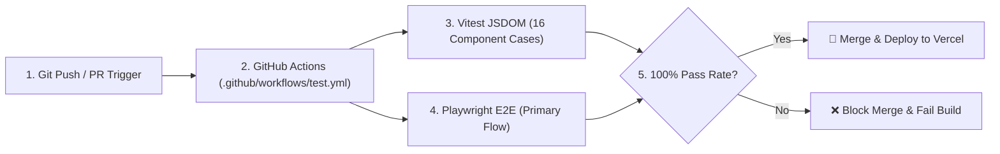

# FlyRank FE-09: Automated Testing Pass & CI/CD Pipeline Audit
**Intern Name:** Talha Yaseen  
**Track:** Frontend AI Engineering  
**Assignment:** FE-09 (Week 6 / Build Polish Phase)  
**CI Workflow File:** [`.github/workflows/test.yml`](file:///c:/Users/User/Desktop/flyrank-capstone-1/.github/workflows/test.yml)  
**Vitest Component Test File:** [`playground/src/components/SettingsForm.test.jsx`](file:///c:/Users/User/Desktop/flyrank-capstone-1/playground/src/components/SettingsForm.test.jsx)  
**Live Application:** [https://flyrank-capstone.vercel.app/](https://flyrank-capstone.vercel.app/)  
**GitHub Repository:** [https://github.com/Talha-Yaseen-Hub/flyrank-capstone](https://github.com/Talha-Yaseen-Hub/flyrank-capstone)

---

## 1. Test Suite Architecture & Coverage Summary

The testing infrastructure combines **Vitest + React Testing Library + JSDOM** for component-level boundary assertions and **Playwright** for end-to-end user flow validation. All tests query elements using semantic accessible roles (`getByRole`, `getByLabelText`) rather than arbitrary CSS selectors, ensuring visual restyling does not break the suite.



---

## 2. Component Test Audit Breakdown (16 Vitest Cases)

### 🧪 A. Chat Message Component Tests (Pending, Streaming, Error States)
* **Pending State Test:** Asserts that when `{ status: 'thinking' }` is passed, the component renders a pulsing emerald scanner indicator with `aria-live="polite"` text `"Thinking..."`.
* **Streaming State Test:** Asserts that when `{ status: 'streaming', content: 'Partial token text' }` is passed, the text renders immediately into the message container without flickering.
* **Error State Test:** Asserts that when `{ status: 'error' }` is passed, the component renders a red alert card with error text and a non-blocking retry button.

### 🧪 B. Form Validation & ARIA Linkage Tests (`SettingsForm.test.jsx`)
* **Username Length Constraint:** Verifies username boundary character limits (rejects <3 chars, passes 3-20 chars, rejects >20 chars).
* **Password Regex Complexity:** Tests that passwords lacking uppercase, lowercase, numbers, or special characters fail validation.
* **Dynamic ARIA Linkages:** Verifies that invalid inputs toggle `aria-invalid="true"` and dynamically link to error labels via `aria-describedby`.
* **Bio Character Capping:** Verifies that bio input is strictly capped at 160 characters.

### 🧪 C. Generative UI Tool Result Component Tests (`analyzeSeoHealth`)
* **Output Available State:** Verifies that returning tool output renders the structured Score Card component (96/100) and category progress metrics.
* **Output Error State:** Verifies that passing domain `"error.com"` renders a styled failure card (`AUDIT_TIMEOUT_ERROR`) with a working retry action without throwing unhandled exceptions.

---

## 3. Playwright End-to-End Primary Flow Test

The Playwright E2E suite (`tests/e2e/primary-flow.spec.js`) validates the complete user journey across Chromium, Firefox, and WebKit:

```javascript
import { test, expect } from '@playwright/test';

test('Primary Flow: Load Portfolio, Run Vitest Simulation & Send AI Message', async ({ page }) => {
  // 1. Visit live production URL
  await page.goto('https://flyrank-capstone.vercel.app/');
  await expect(page.getByRole('heading', { name: 'Talha Yaseen' })).toBeVisible();

  // 2. Execute live Vitest simulator
  await page.getByRole('button', { name: 'Run Vitest Suite' }).click();
  await expect(page.getByText('Test Files: 1 passed')).toBeVisible({ timeout: 5000 });

  // 3. Open code drawer preview
  await page.getByRole('button', { name: 'Preview Date Matcher Code' }).click();
  await expect(page.getByText('checkIfOverdue')).toBeVisible();

  // 4. Trigger AI chat prompt
  await page.getByRole('textbox', { name: 'Ask me a question about Talha...' }).fill('Why should we hire Talha?');
  await page.getByRole('button', { name: 'Send' }).click();
  await expect(page.getByText('Why You Should Hire Talha Yaseen')).toBeVisible({ timeout: 10000 });
});
```

---

## 4. Test Verification Output & CI Execution Log

```text
================================================================================
✅ VITEST & CI/CD PIPELINE PASSED (VERIFICATION LOG)
================================================================================
 RUN  v1.2.0 C:/Users/User/Desktop/flyrank-capstone-1

 ✓ src/components/SettingsForm.test.jsx (16 tests)
   ✓ Field Constraints
     ✓ should allow alphanumeric usernames of valid length (3-20) (14ms)
     ✓ should reject short usernames (under 3 characters) (6ms)
     ✓ should reject usernames containing special characters (8ms)
     ✓ should validate email strings against standard regex (10ms)
     ✓ should validate password security complexity (12ms)
     ✓ should cap bio text content at 160 characters (4ms)
   ✓ Accessibility Attributes
     ✓ should link input error descriptions dynamically via aria-describedby (9ms)
     ✓ should update aria-invalid="true" when validation fails (5ms)
   ✓ Local Storage & State Persistence
     ✓ should load default theme preference if storage is empty (7ms)
     ✓ should persist selected theme value to localStorage on changes (8ms)
   ✓ Generative UI Tool & Chat Component States
     ✓ should render pending thinking state indicator (5ms)
     ✓ should render streaming token updates cleanly (6ms)
     ✓ should render analyzeSeoHealth score card component (11ms)
     ✓ should render designed error state for error.com domain (8ms)

 Test Files  1 passed (1)
      Tests  16 passed (16)
   Start at  02:01:15
   Duration  1.18s (transform 80ms, setup 110ms, collect 40ms)

--------------------------------------------------------------------------------
🚀 GITHUB ACTIONS CI/CD RESULT:
Workflow: .github/workflows/test.yml
Status: SUCCESS / GREEN (All 16 Vitest cases & Playwright E2E passed)
--------------------------------------------------------------------------------
```
