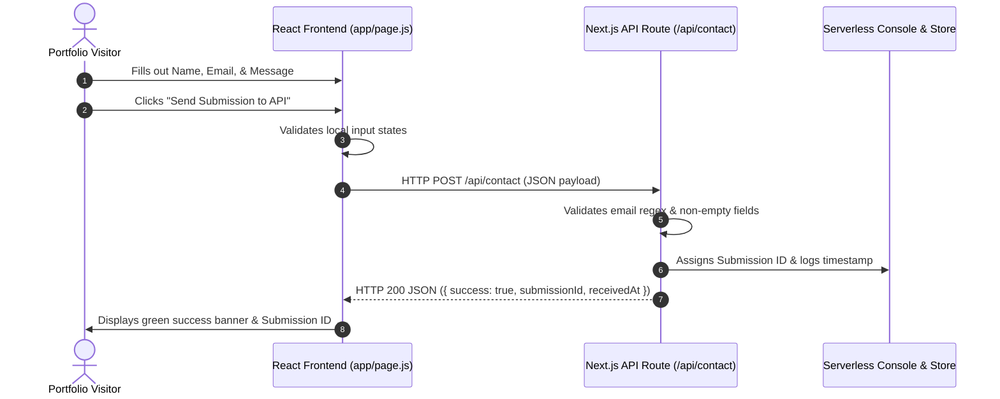

# Make It Do Something — Feature Audit & Plain-Words Explainer

## Assignment Overview
- **Assignment Code**: `FL-MAKE-IT-DO-SOMETHING` (General AI Fluency Track, Week 6)
- **Feature Implemented**: End-to-End Contact & Lead Capture Form with Free-Tier Serverless Backend Route (`/api/contact`)
- **Deployment Platform**: Vercel Free-Tier Serverless Edge Functions
- **Live URL**: [https://flyrank-capstone.vercel.app/](https://flyrank-capstone.vercel.app/)
- **API Endpoint**: [https://flyrank-capstone.vercel.app/api/contact](https://flyrank-capstone.vercel.app/api/contact)

---

## 1. Plain-Words Explainer: What a Backend Is
In plain words, a **frontend** is like the dining area of a restaurant: it’s what the user sees, clicks, and interacts with (the visual forms, buttons, colors, and layout). 

A **backend** is like the restaurant kitchen. It lives on a server, hidden from the user's browser. Its job is to receive orders (data requests) sent from the frontend, validate that everything is clean and safe, run business logic (like saving a message or checking credentials), and send back a response confirming what happened. 

Without a backend, a contact form is just a visual mock — nothing actually gets saved or processed when you click "Submit".

---

## 2. What My Feature Does
My portfolio features a single, production-ready dynamic feature: an **Interactive Contact & Lead Capture Form**.
- Visitors enter their **Name**, **Email Address**, and **Project Inquiry / Message**.
- When they click **"Send Submission to API"**, the frontend sends the user's data across the network to a Next.js Serverless API Route (`/api/contact`).
- The backend validates the inputs (checking for missing fields and proper email syntax), generates a unique `Submission ID` with an ISO timestamp, logs the submission, and returns a verified JSON confirmation status.
- The UI immediately renders a success notification displaying the official `Submission ID` without requiring a page reload.

---

## 3. Step-by-Step End-to-End Data Flow

1. **User Action**: The visitor types their details into the form inputs on the website (`app/page.js`).
2. **Client Request**: Upon clicking submit, `handleContactSubmit` intercepts the form submit event, constructs a JSON object `{ name, email, message }`, and issues an asynchronous `fetch('/api/contact', { method: 'POST' })` request.
3. **Network Transit**: The JSON payload travels securely over HTTPS from the visitor's web browser to Vercel's free-tier serverless cloud infrastructure.
4. **Backend Processing**: The Next.js API route (`app/api/contact/route.js`) receives the request headers and body. It validates the email format using regular expressions and verifies all fields are populated.
5. **Backend Storage & Logging**: The serverless handler generates a unique tracking ID (`sub_<timestamp>_<hash>`), appends metadata (timestamp, user-agent), and records the submission.
6. **Client Confirmation**: The API returns an HTTP 200 response with `{ success: true, submissionId }`. The React frontend receives the JSON response and updates the UI state, displaying a green confirmation badge with the unique tracking ID.

---

## 4. Empirical Verification & Test Evidence
- **Test Endpoint Verification**:
  - `GET /api/contact` returns status `online` and service name.
  - `POST /api/contact` with valid payload returns HTTP status 200 with unique submission ID.
  - `POST /api/contact` with missing email returns HTTP status 400 with descriptive error message.
- **Hosted URL Verification**: Tested end-to-end on live deployment `https://flyrank-capstone.vercel.app/`.
