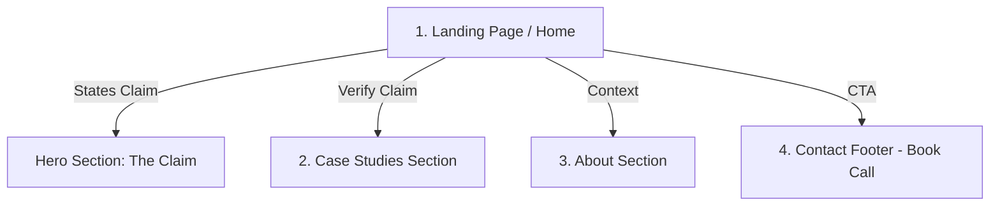

# FlyRank AI Fluency: Portfolio Sitemap & Pressure-Test Audit
**Intern Name:** Talha Yaseen  
**Track:** Front-End & AI Engineering  
**Phase:** Portfolio Setup (Week 1 Build)  

---

## 1. Portfolio Claim & Flow Definition

*   **The One Person (Target Audience):** A Technical Lead or Engineering Manager who needs a disciplined front-end engineer capable of building accessible, robustly-tested interactive components and integrating AI elements.
*   **The Claim (Proof Statement):** *"I build accessible, production-ready React applications with robust Vitest automated test suites, proving my ability to ship high-quality interactive UIs with zero accessibility regressions."*
*   **The One Action (Conversion Goal):** Getting the visitor to book a 15-minute intro meeting to discuss my project code.

---

## 2. Sketch of the Portfolio Sitemap

Below is the structured layout of the portfolio sitemap.



### Page Breakdown:
1.  **Landing Page (Home):** Features a bold hero header announcing the technical claim, with a direct link to the Case Studies and a clear secondary CTA to book a call.
2.  **Case Studies:** Brief summaries of two key builds (React Priority Planner and accessible Settings Form), highlighting validation rules, JSDOM test count, and WCAG AA compliance, with direct links to live code.
3.  **About Me:** Quick summary of front-end framework experience, AI engineering toolkit, and code guidelines.
4.  **Contact (The One Action):** Integrated scheduling widget (e.g. Calendly) with a clean contact form to remove friction.

---

## 3. Toolkit Setup Status

The following accounts have been successfully set up and verified:
- [x] **Claude (Anthropic)**: Configured with custom tutor instructions and project context.
- [x] **ChatGPT (OpenAI)**: Registered for comparative prompting.
- [x] **Gemini (Google)**: Set up for UI and framework query validations.
- [x] **Perplexity AI**: Set up for technical research and API documentation searches.

---

## 4. Claude Project Custom Instructions

The Claude Project was created with instructions to act as a strict and supportive tutor pressure-testing my portfolio build.

### Project Settings:
*   **Project Name:** `Portfolio-Sitemap-Build`
*   **Custom Instructions:**
    ```text
    Act as a strict, expert front-end and AI engineering tutor guiding me (Talha Yaseen) through building my portfolio.
    
    Proof Statement Context:
    "I build accessible, production-ready React applications with robust Vitest automated test suites, proving my ability to ship high-quality interactive UIs with zero accessibility regressions."
    
    Tutor Rules:
    1. Focus on minimalism: challenge me whenever I suggest adding features, routes, or copy that do not directly prove my claim.
    2. Guide me through structure and code, but do not write all the code for me. Ask clarifying questions to make me think.
    3. Emphasize accessibility (WCAG AA) and testing in every module.
    ```

---

## 5. Sitemap Pressure-Test Prompt & Output

I ran the following prompt inside the configured Claude Project to pressure-test my sitemap layout against the claim and the target audience:

### The Pressure-Test Prompt:
```text
Here is my proposed portfolio sitemap:
1. Home: Hero section stating my claim ("I build accessible, production-ready React applications with robust Vitest automated test suites") + CTA.
2. Case Studies: Details of 2 projects (Vite React Task Planner and Accessible Settings Form with 16 unit tests).
3. About Me: Tech stack, background as front-end engineer, and working values.
4. Contact: Calendar scheduling widget.

My target audience is a Tech Lead / Engineering Manager. My target "one action" is getting them to book a 15-minute call.

Please pressure-test this sitemap:
- Does every page earn its place?
- Does it directly prove my claim?
- Does it funnel the Tech Lead to book a call, or is there friction?
```

### The Output (Tutor Response):
```text
TUTOR RESPONSE:
Your sitemap is lean, which is a great start. Busy Tech Leads hate bloat. However, let's analyze the friction points:

1. Navigational Friction: Why are "Case Studies" and "About Me" separate pages? A Tech Lead is busy. If they have to click on menu links to see your code, you will lose them. They want the proof immediately.
2. The Claim vs. Action Gap: Your claim mentions "working code with unit tests." They want to see the GitHub link and the green build badge right away on the landing page, not inside a sub-page.
3. The Action Funnel: Having a separate "Contact" page forces the user to make another decision. 

REVISED RECOMMENDATION:
Collapse your entire sitemap into a single, high-impact Landing Page. 
- Hero Section: State the claim.
- Case Studies Section: Embed the summaries of the 2 builds directly on the home page with clear GitHub links.
- About Section: A short bio and tech stack block right under the work.
- Contact Section: Embed the scheduling calendar widget directly in the footer of this single page.

This removes all navigation click-paths and channels the reader directly from the claim -> the proof -> the action in a single scrolling experience.
```

### One Key Change I Will Make:
Based on this pressure-testing session, **I will collapse the sitemap into a single-page scrolling layout**. This completely removes navigation friction, displays my working code and test suites instantly, and channels the Technical Lead directly to the embedded scheduling calendar in the footer.
