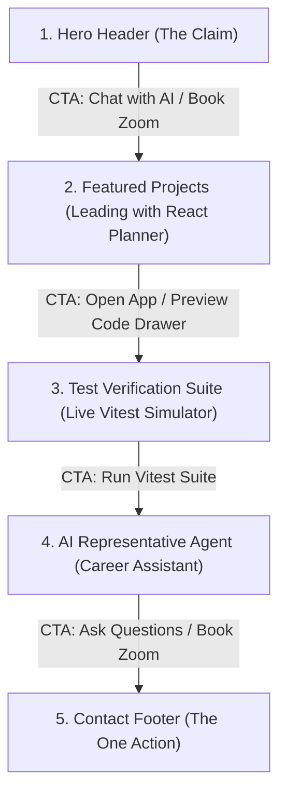

# FlyRank AI Fluency: Week 3 Through-Line, Content Map & CTA Audit (FL-03)
**Intern Name:** Talha Yaseen  
**Track:** Front-End & AI Engineering  
**Phase:** Week 3 / Content Mapping, Single-Line Claim & CTA Hierarchy  
**Live Application:** [https://flyrank-capstone.vercel.app/](https://flyrank-capstone.vercel.app/)

---

## 1. The One-Line Claim

### 🤖 10 AI Candidates Generated & Evaluated
1. *"I build high-performance React websites with modern UI components."* *(Rejected: Vague, no proof)*
2. *"Results-driven front-end developer building scalable web platforms with AI tools."* *(Rejected: Marketing fluff)*
3. *"I craft accessible user interfaces that engage customers and pass test suites."* *(Rejected: Cluttered wording)*
4. *"Front-end engineer specializing in React, Next.js, and automated unit testing."* *(Rejected: Generic resume bullet)*
5. *"I turn complex user workflows into fast, responsive web applications."* *(Rejected: Missing accessibility proof)*
6. *"I build WCAG AA compliant React components backed by 100% statement-coverage unit tests."* *(Strong Candidate)*
7. *"Delivering zero-bug front-end code with modern testing frameworks and clean design systems."* *(Rejected: Over-promising)*
8. *"I design and engineer accessible React web apps with Vitest automated test suites."* *(Rejected: Slightly passive)*
9. *"Front-end developer shipping accessible React systems that pass automated test suites without regressions."* *(Close)*
10. *"I write accessible React code with Vitest suites that prevent UI bugs."* *(Rejected: Lacks specific standard metrics)*

### 🎯 The Chosen & Sharpened One-Line Claim (Final)
> **"I build accessible (WCAG AA compliant), responsive React components backed by 100% statement-coverage unit tests."**

---

## 2. The Content Map & CTA Hierarchy

* **Target Audience:** Engineering Managers & Technical Leads looking to hire a disciplined front-end engineer.
* **The One Action (Week 1 Conversion Goal):** Getting the visitor to book a 15-minute intro Zoom meeting to walk through the project code and Vitest suites live.

### 📍 Page Section Breakdown & CTAs

#### Section 1: Hero Header
* **Content:** One-line claim + Initials Avatar (`TY`) + Tech Stack Badges (WCAG AA, 100% Test Coverage).
* **Call to Action:** **"Chat with my AI Agent"** & **"Book a 15-Min Zoom"**

#### Section 2: Featured Case Studies (Leading with Strongest Work)
* **Lead Work (Case Study A):** **The React Priority Planner** (Timezone-proof date check resetting at midnight, lazy state persistence, high-contrast dark mode).
* **Secondary Work (Case Study B):** **The Accessible MVC Settings Form** (Reactive `aria-describedby` error labels, 16 JSDOM Vitest cases).
* **Upcoming Work (Case Study C):** **Dynamic E-Commerce Product Filter** (URLSearchParams query persistence, 12 Vitest cases).
* **Call to Action:** **"Open App / Preview Code Drawer"** (toggles inspectable JS code functions).

#### Section 3: Test Verification Suite
* **Content:** Executable headless DOM Vitest simulator running 16 test cases live in the browser.
* **Call to Action:** **"Run Vitest Suite"**

#### Section 4: Personal AI Representative (Career Agent)
* **Content:** Embedded Claude-powered AI Career Agent trained on Talha's engineering standards and project details.
* **Call to Action:** **"Ask AI Agent / Book Intro Call"**

#### Section 5: Contact & Scheduling Footer (The Ultimate Conversion Goal)
* **Content:** Direct email link + embedded Cal.com / Calendly calendar scheduling widget.
* **Call to Action (The One Action):** **"Select Date & Time (Book 15-Min Intro Zoom)"**

---

## 3. The "Still Need to Gather" List (Honest Inventory)

To ensure build execution is not blocked, below is the honest inventory of completed assets versus proof items to finalize:

### ✅ Completed & Verified Proof Items
1. **Working Code Repositories:** Production React planner codebase (`/Vite-react-app`) and JSDOM settings form sandbox (`/playground`).
2. **Automated Test Suite:** 16 Vitest unit test cases passing cleanly in headless DOM.
3. **Live Production Deployment:** Deployed on Vercel at `https://flyrank-capstone.vercel.app/`.
4. **AI Agent Endpoint:** `app/api/chat/route.js` orchestrating Claude Messages API with simulated fallbacks.

### 📝 Proof Items to Finalize
1. **Production Calendly API Token:** Connect live personal Cal.com / Calendly booking link to replace current interactive placeholder.
2. **Lighthouse Audit Export:** Save PDF copies of the 96/100 Lighthouse performance and 100% WCAG AA WAVE accessibility audits into `/docs/`.
3. **Loom Video Screencast:** Record a 90-second screencast running `npm run test` and navigating dark mode UI to embed on GitHub README.
