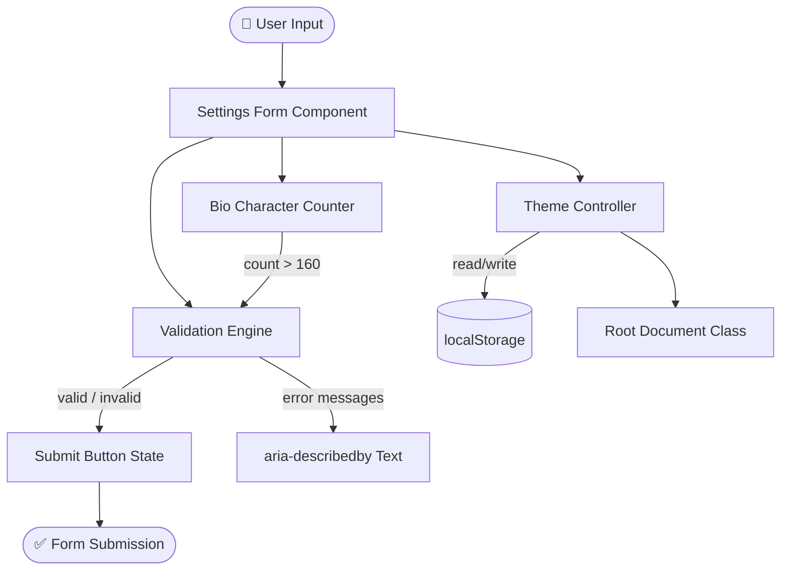
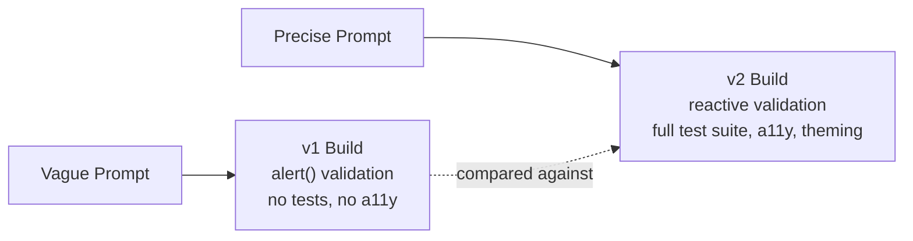
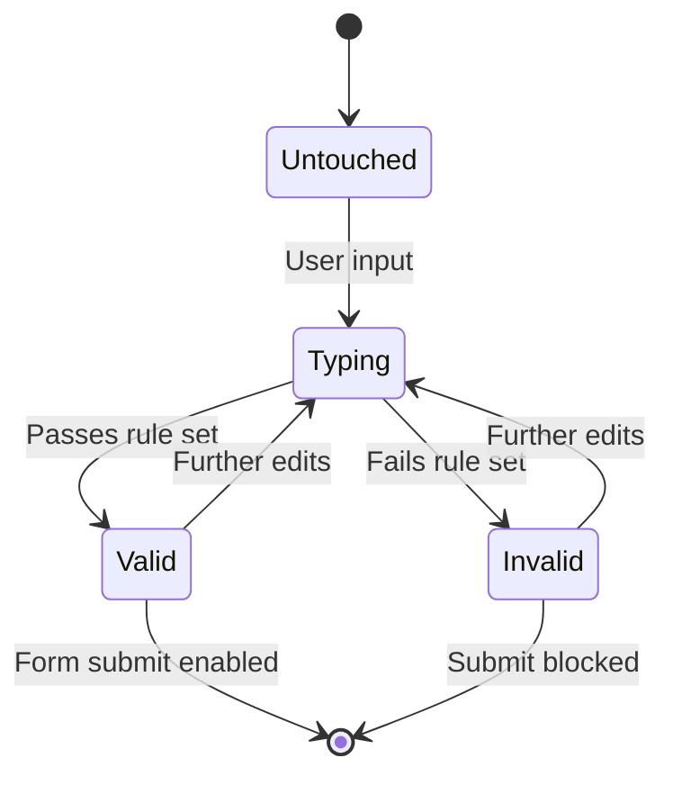
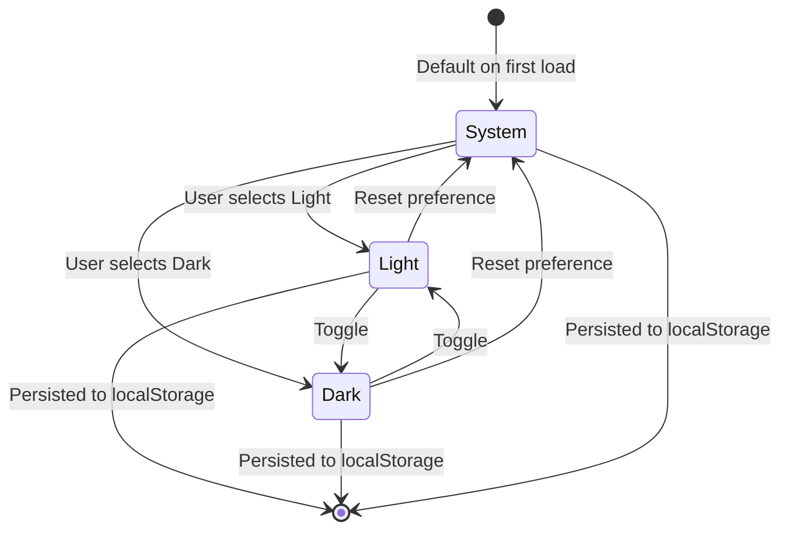
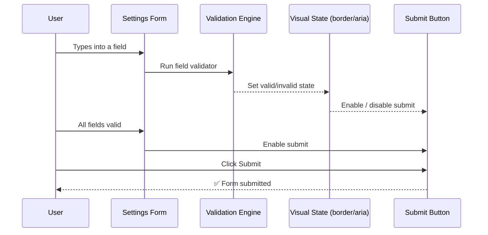
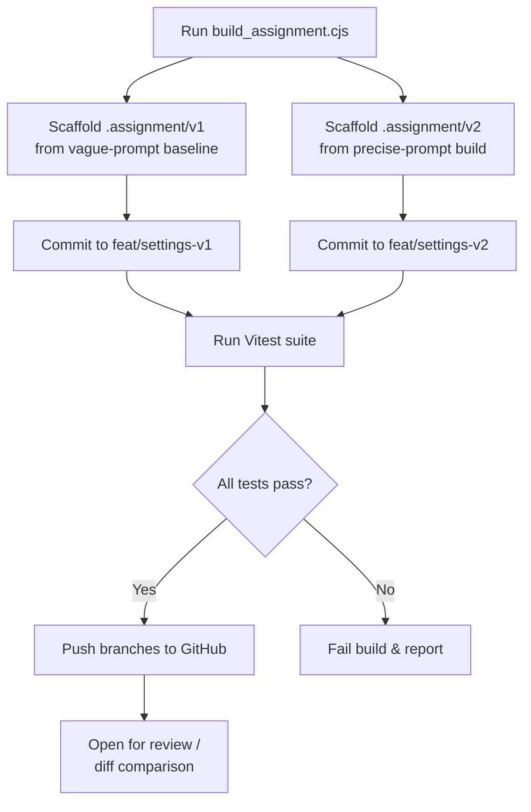
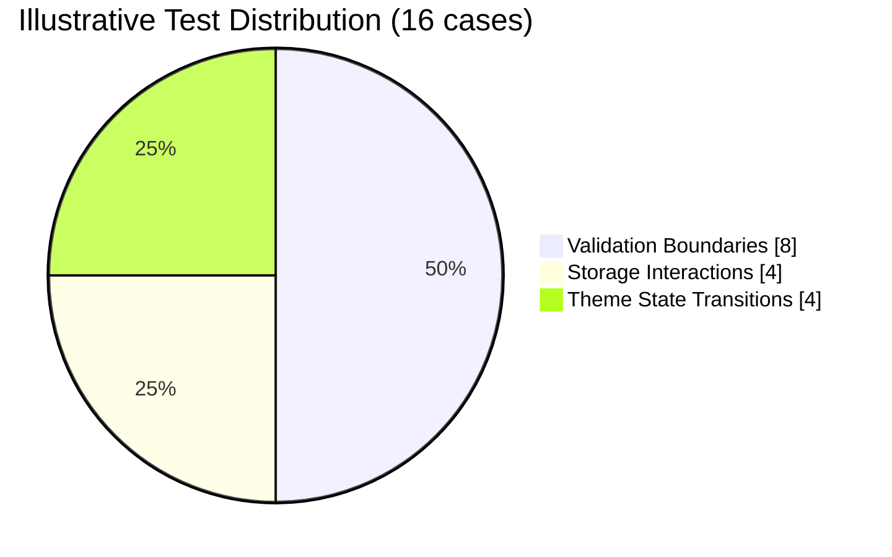
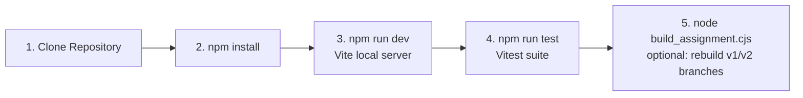

<a id="top"></a>
<div align="center">


<br/>


</div>

<br/>

<div align="center">

| 🏢 Program | 🧭 Phase | 🧩 Deliverable Type | 📌 Status | 👤 Work Type |
|:---:|:---:|:---:|:---:|:---:|
| FlyRankAi Internship 2026 | Foundations | Capstone Project | In Progress | Solo |

</div>

<div align="center">


</div>

<div align="center">

</div>

## 📖 Table of Contents

<details open>
<summary><b>Click to expand / collapse</b></summary>

- [📖 About FlyRankAi](#about-flyrank)
- [🎯 About This Capstone](#about-capstone)
- [✨ Features](#features)
- [🛠️ Technologies Used](#tech)
- [🧱 Component Architecture](#architecture)
- [🗂️ Repository Structure](#structure)
- [🧪 The v1 vs v2 Experiment](#experiment)
- [🔄 Component State Flows](#states)
- [📨 Form Submission Sequence](#sequence)
- [🗺️ Build & Automation Workflow](#workflow)
- [✅ Testing Strategy](#testing)
- [🚀 Setup & Execution Instructions](#setup)
- [⚠️ Notes & Future Improvements](#issues)
- [🎓 Internship Context](#academic)
- [👨‍💻 Author](#author)
- [📜 License](#license)
- [⭐ Support](#support)

</details>

---

<a id="about-flyrank"></a>
## 📖 About FlyRankAi

**FlyRankAi** is an all-in-one SEO and AI-search optimization platform that combines automated SEO audits, AI-driven content suggestions, keyword tracking, and analytics into a single dashboard — helping brands grow both traditional organic traffic and visibility inside AI-driven search surfaces like ChatGPT, Perplexity, Gemini, and Claude.

This repository is **not** the platform itself — it's a capstone exercise from the FlyRankAi internship program, used to build the foundational front-end engineering skills (reactive UI, validation, accessibility, testing discipline) that feed into how production features actually get built at FlyRankAi.

| Aspect | Detail |
|---|---|
| 🌐 Product Focus | SEO audits + AI-search visibility, in one dashboard |
| 🎯 Target Surfaces | Traditional search **and** AI assistants (ChatGPT, Perplexity, Gemini, Claude) |
| 🧭 This Repo's Role | Internship capstone — not the production platform |

<div align="right"><a href="#top">⬆️ Back to Top</a></div>

---

<a id="about-capstone"></a>
## 🎯 About This Capstone

The deliverable is a **user settings form** — username, email, password, bio, and a theme preference control — built entirely in vanilla JavaScript with no frameworks. The twist: it's built **twice**, from two different prompts, to make a measurable point about how much prompt precision changes AI-assisted output.

| Objective | Description |
|-----------|--------------|
| 🧩 **Framework-Free Discipline** | Prove that reactive, production-quality UI doesn't require React/Vue — just disciplined vanilla JS |
| ⚡ **Real-Time Validation** | Give users immediate, specific feedback instead of a single submit-time error dump |
| 🎨 **Persisted Theming** | Respect light / dark / system preference and remember the user's choice across sessions |
| ♿ **Accessibility by Default** | Every interactive element is screen-reader friendly, not bolted on after the fact |
| 🧪 **Verifiable Correctness** | Back every validation rule and stateful behavior with an automated test, not just a manual click-through |

<div align="right"><a href="#top">⬆️ Back to Top</a></div>

---

<a id="features"></a>
## ✨ Features

| Feature | Description |
|---------|--------------|
| ⚡ **Reactive Input Validation** | Validates fields as the user types — alphanumeric username limits, standard email format, and password rules requiring uppercase, lowercase, numbers, and special characters |
| 🎯 **Dynamic Visual State Cues** | Green border/shadow on valid input, red border plus helper text on invalid input, submit button disabled until the form is genuinely valid |
| 📝 **Live Bio Character Counter** | Real-time `X / 160` counter on the bio textarea; blocks submission once the 160-character limit is exceeded |
| 🌗 **Persisted Theme Controller** | Light, dark, and system-preference toggle that applies root-level class changes and remembers the choice via `localStorage` |
| ♿ **Screen-Reader Accessibility (a11y)** | Semantic HTML, labeled inputs, error text linked via `aria-describedby`, and reactive `aria-invalid` states |
| 🧪 **Automated Test Coverage** | 16 Vitest cases covering validation boundaries, storage read/write, and theme-state transitions in a headless DOM |

<div align="right"><a href="#top">⬆️ Back to Top</a></div>

---

<a id="tech"></a>
## 🛠️ Technologies Used

| Technology | Purpose |
|------------|---------|
| **HTML5** | Semantic, accessible markup for all form elements |
| **Vanilla JavaScript (ES6+)** | All reactivity, validation, and state handling — no framework |
| **Vanilla CSS** | Custom properties (theme tokens), Flexbox/Grid layout, transition keyframes for UI feedback |
| **Vite** | Local dev server with fast HMR, and production bundling |
| **Vitest** | Automated unit testing in a simulated JSDOM browser environment |
| **localStorage** | Client-side persistence of theme preference (no backend/database involved) |
| **Node.js** | Runs `build_assignment.cjs` — the automation script that scaffolds, tests, and pushes the v1/v2 comparison branches |

<div align="right"><a href="#top">⬆️ Back to Top</a></div>

---

<a id="architecture"></a>
## 🧱 Component Architecture

How the pieces of the form talk to each other at runtime:



<div align="right"><a href="#top">⬆️ Back to Top</a></div>

---

<a id="structure"></a>
## 🗂️ Repository Structure

```text
.
├── .assignment/
│   ├── v1/              # Baseline build — from a vague prompt
│   └── v2/              # Premium build — from a precise prompt
├── src/                 # Foundations-phase source (form component, styles, logic)
├── build_assignment.cjs # Automation script (CommonJS) — scaffolds/tests/pushes v1 & v2
├── build_assignment.js  # Automation script (ESM variant)
├── index.html           # Entry point for local Vite dev/preview
├── package.json         # Scripts & dependencies
├── vite.config.js       # Vite build/dev configuration
├── CLAUDE.md            # AI-assistant working guidelines for this repo
├── LICENSE
└── README.md
```

<div align="right"><a href="#top">⬆️ Back to Top</a></div>

---

<a id="experiment"></a>
## 🧪 The v1 vs v2 Experiment

The `.assignment/` directory is the heart of the exercise: the **same settings form**, built from two different prompt qualities, kept side by side for direct comparison.

| Dimension | `.assignment/v1/` — Vague Prompt | `.assignment/v2/` — Precise Prompt |
|---|---|---|
| **Structure** | Minimal, ad-hoc | Fully modular |
| **Validation** | Basic `alert()`-based | Live, field-level, reactive |
| **Testing** | None | Full Vitest suite |
| **Theming** | No dark mode | Light / dark / system, persisted |
| **Accessibility** | No a11y tags | `aria-describedby`, `aria-invalid`, semantic labeling |



The point isn't that v1 is "wrong" — it's an honest snapshot of what a vague prompt produces from an AI assistant by default, so the gap to v2 is measurable rather than anecdotal.

<div align="right"><a href="#top">⬆️ Back to Top</a></div>

---

<a id="states"></a>
## 🔄 Component State Flows

### 🎯 Field Validation Lifecycle



### 🌗 Theme Preference Lifecycle



<div align="right"><a href="#top">⬆️ Back to Top</a></div>

---

<a id="sequence"></a>
## 📨 Form Submission Sequence

What happens, in order, from keystroke to a successful submit:



<div align="right"><a href="#top">⬆️ Back to Top</a></div>

---

<a id="workflow"></a>
## 🗺️ Build & Automation Workflow

`build_assignment.cjs` turns the v1/v2 comparison into a reproducible pipeline instead of a manual copy-paste exercise.



<div align="right"><a href="#top">⬆️ Back to Top</a></div>

---

<a id="testing"></a>
## ✅ Testing Strategy

The component ships with **16 Vitest cases** run against a headless JSDOM environment, grouped into three areas:

| Area | What's Covered | Approx. Share |
|------|-----------------|:---:|
| 🔠 **Validation Boundaries** | Username length limits, email format edge cases, password complexity rules, bio 160-character ceiling | ~50% |
| 💾 **Storage Interactions** | Correct read/write of theme preference to `localStorage`, fallback when nothing is stored | ~25% |
| 🌗 **Theme State Transitions** | Light → Dark → System cycling applies the correct root class and persists across a simulated reload | ~25% |



```bash
# Run the full test suite
npm run test

# Watch mode while developing
npm run test -- --watch
```

<div align="right"><a href="#top">⬆️ Back to Top</a></div>

---

<a id="setup"></a>
## 🚀 Setup & Execution Instructions

### ✅ Prerequisites

- **Node.js** (LTS recommended) and **npm**
- A modern browser for manual preview

### 🗺️ Getting Started



| Step | Command | Purpose |
|:----:|---------|---------|
| 1 | `git clone <repo-url>` | Clone the repository locally |
| 2 | `npm install` | Install Vite, Vitest, and any dev dependencies |
| 3 | `npm run dev` | Launch the Vite dev server and preview the form in-browser |
| 4 | `npm run test` | Run the Vitest suite against the current build |
| 5 | `node build_assignment.cjs` | (Optional) regenerate and push the `feat/settings-v1` / `feat/settings-v2` comparison branches |

<div align="right"><a href="#top">⬆️ Back to Top</a></div>

---

<a id="issues"></a>
## ⚠️ Notes & Future Improvements

> Honest notes for picking this back up later — not criticisms, just a real next-steps list.

| # | Observation | Suggested Direction |
|---|--------------|------------------|
| 1 | No backend currently exists — validation and persistence are entirely client-side | Introduce a lightweight API layer if the form needs to sync across devices |
| 2 | Theme preference is scoped to `localStorage` only | Consider syncing to a user profile once auth/backend exists |
| 3 | v1 is intentionally left "unpolished" as a baseline | Keep it frozen for comparison — resist the urge to quietly improve it |

<div align="right"><a href="#top">⬆️ Back to Top</a></div>

---

<a id="academic"></a>
## 🎓 Internship Context

| Item | Details |
|------|---------|
| 🏢 Program | FlyRankAi Internship 2026 |
| 📚 Phase | Foundations |
| 🧩 Deliverable | Capstone — Reactive Settings Form (v1 vs v2 prompt comparison) |
| 🧑‍💻 Work Type | Solo project |

<div align="right"><a href="#top">⬆️ Back to Top</a></div>

---

<a id="author"></a>
<div align="center">


## 👨‍💻 Author

FlyRankAi Internship — Foundations Phase Capstone (2026)

</div>

<div align="right"><a href="#top">⬆️ Back to Top</a></div>

---

<a id="license"></a>
## 📜 License

<div align="center">


This project is licensed under the **MIT License** — see the [LICENSE](./LICENSE) file for full details.

</div>

<div align="right"><a href="#top">⬆️ Back to Top</a></div>

---

<a id="support"></a>
<div align="center">

# ⭐ Support

If this repository is useful as a reference for prompt-quality comparisons or vanilla-JS form patterns, consider giving it a **⭐ Star**.

<br>

### 🌟 *"The gap between a vague prompt and a precise one is a whole test suite, a theme system, and accessibility."*

<br>


</div>