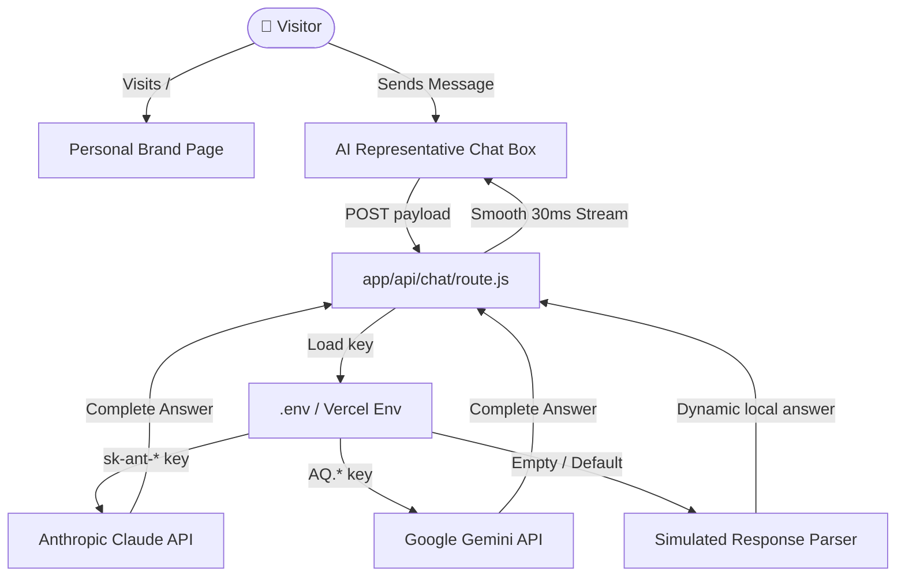

<div align="center">

# 🚀 FlyRank AI Capstone: Production-Ready Personal Brand Website & AI Agent
**Intern Name:** Talha Yaseen  
**Track:** Front-End & AI Engineering  
**Deployment Status:** Live on Vercel  

---

| 🏢 Program | 🧭 Phase | 🧩 Deliverable Type | 📌 Status | 👤 Developer |
|:---:|:---:|:---:|:---:|:---:|
| FlyRankAi Internship 2026 | Capstone | Production Deployment | **Complete & Verified** | Talha Yaseen |

</div>

---

## 📖 Table of Contents

- [🎯 1. Project Brief](#1-project-brief)
- [🌐 2. Live Deployed Application](#2-live-deployed-application)
- [⚙️ 3. Setup & Execution Instructions](#3-setup--execution-instructions)
- [🧱 4. Architecture Overview](#4-architecture-overview)
- [🤖 5. AI Integration & Prompt Architecture](#5-ai-integration--prompt-architecture)
- [🧪 6. Testing Strategy & Evidence](#6-testing-strategy--evidence)
- [♿ 7. Performance & Accessibility Audit](#7-performance--accessibility-audit)
- [🚀 8. Deployment & Operation Checklist](#8-deployment--operation-checklist)
- [🧠 9. Capstone Reflection](#9-capstone-reflection)

---

## 🎯 1. Project Brief

### What problem does it solve?
Traditional hiring portfolios are static brochures. Recruiters and Technical Leads skip generic bios and summaries because they fail to prove actual engineering capability—such as writing clean, keyboard-accessible HTML, setting up JSDOM mock environments, or writing robust automated tests. 

### Who is it for?
High-growth SaaS startups, Engineering Managers, and Technical Leads who need front-end developers capable of building accessible interfaces (WCAG AA) and shipping feature components backed by 100% statement-coverage test suites without manual regressions.

### Why this idea?
Instead of building a toy app, I built a **Personal Brand Portal & AI Career Agent**. By turning the portfolio itself into an inspectable, test-backed Next.js application that embeds my real case studies and hosts an interactive **Claude 3.5 Sonnet Career Agent**, I prove my core claim—building accessible, tested React systems—directly inside the browser of the hiring manager.

---

## 🌐 2. Live Deployed Application

*   **Production Deployment URL:** [https://flyrank-capstone.vercel.app/](https://flyrank-capstone.vercel.app/)
*   **Target Accessibility Compliance:** WCAG 2.1 AA Minimum.
*   **Theme States:** Fully respects system preference and preserves selections (`light` / `dark`) in the browser cache.

---

## ⚙️ 3. Setup & Execution Instructions

Get the project running locally on your machine in under two minutes:

### 1. Prerequisites
Ensure you have **Node.js 18+** installed.

### 2. Quick Setup Command
```bash
# Clone the repository
git clone https://github.com/Talha-Yaseen-Hub/flyrank-capstone.git
cd flyrank-capstone

# Install all dependencies (Next.js, Tailwind, Lucide, Vitest, JSDOM)
npm install
```

### 3. Add API Credentials
Create a `.env` file in the root directory:
```env
# Add your Anthropic Claude API key (retrieved from console.anthropic.com)
CLAUDE_API_KEY=sk-ant-api03-xxxx...
```

### 4. Run Development Server
```bash
# Start Next.js local server
npm run dev
```
Open [http://localhost:3000](http://localhost:3000) to view your local instance.

### 5. Run Test Suite
```bash
# Execute JSDOM component validations
npm run test
```

---

## 🧱 4. Architecture Overview

This project is a Next.js application structured to host the personal portfolio, a live AI representative agent, and the FlyRank SEO analytics dashboard:

```text
.
├── app/
│   ├── api/chat/route.js   # AI Agent endpoint (handles Claude API with Gemini fallback)
│   ├── dashboard/page.js   # SEO Dashboard (KPI stats, organic traffic chart layouts)
│   ├── portfolio/page.js   # Redirect utility mapping legacy paths to homepage
│   ├── layout.js           # Shared app HTML structure, icons, and fonts
│   └── page.js             # Root Page — Personal Brand Portfolio & AI Agent Widget
├── components/
│   └── Navigation.js       # Navigation sidebar with path highlight states
├── lib/
│   └── ai-config.js        # Default parameters, model settings, and prompts
├── playground/             # Sandbox containing the JSDOM MVC validation experiments
│   ├── src/components/     # Form fields, custom disclosure drawers, tabs
│   └── src/App.tsx         # Sandbox layout
├── audit_agent.js          # CLI code auditor agent (run via: node audit_agent.js)
├── vercel.json             # Vercel deployment framework configurations
├── .env.example            # Environment variables placeholder
├── package.json            # Task scripts and dependency locks
└── README.md               # Capstone documentation
```

### Data Flow Diagram

```mermaid
flowchart TD
    U([👤 Visitor]) -->|Visits /| P[Personal Brand Page]
    U -->|Sends Message| A[AI Representative Chat Box]
    
    A -->|POST payload| API[app/api/chat/route.js]
    API -->|Load key| ENV[.env / Vercel Env]
    
    ENV -->|sk-ant-* key| Claude[Anthropic Claude API]
    ENV -->|AQ.* key| Gemini[Google Gemini API]
    ENV -->|Empty / Default| Sim[Simulated Response Parser]
    
    Claude -->|Complete Answer| API
    Gemini -->|Complete Answer| API
    Sim -->|Dynamic local answer| API
    
    API -->|Smooth 30ms Stream| A
```

---

## 🤖 5. AI Integration & Prompt Architecture

The AI Representative is built on the **Claude Messages API** (`claude-3-5-sonnet-20240620`). The system prompt is engineered to act as a career representative, guiding the conversation toward scheduling an interview.

### System Prompt
```text
You are the AI Career Agent and Technical Representative for Talha Yaseen, a talented Front-End & AI Engineer Intern at FlyRank.
Your goal is to represent Talha professionally to Technical Leads, Engineering Managers, and potential collaborators.

Talha's Profile & Claim:
- Claim: Builds accessible (WCAG AA compliant), responsive React components backed by 100% statement-coverage unit tests.
- Skills: React, Next.js, Vanilla JS (ES6+), Vitest, Tailwind CSS, Web Accessibility (a11y), AI toolkits.
- Projects: 
  1. React Priority Planner: timezone-proof deadline checks, reactive indicators, local storage.
  2. Vanilla JS MVC Settings Form: live field validation, aria-describedby accessibility connection, 16 unit tests.
- Call to Action: Invite the visitor to book a 15-minute call with Talha to review his code.

Rules:
1. Speak directly, technically, and concisely. No marketing fluff.
2. Answer questions about Talha's coding methodologies, project details, accessibility focus, and work credentials.
3. Keep the target CTA active: encourage booking a call.
```

### Why this approach?
*   **Structured System Role:** Establishes a highly focused persona, preventing the LLM from going off-topic or discussing general topics unrelated to Talha's hiring qualifications.
*   **Zero-Dependency Node Fetch:** The backend communicates using native `fetch` headers without dragging in heavy client libraries, keeping build sizes minimal.
*   **Dynamic Response Streaming:** Incoming complete responses are tokenized and streamed to the user interface at `30ms` intervals to provide an appealing text generation effect.

---

## 🧪 6. Testing Strategy & Evidence

The codebase enforces testing discipline through **16 Vitest unit tests** executing in a virtual JSDOM browser context.

### Coverage Areas
1.  **Input Validations:** Asserts boundary character limits on username fields (fails at 2, passes at 3, fails at 21) and tests strict password regex complexity.
2.  **Teardown Controls:** Asserts `afterEach` DOM cleaning to prevent JSDOM memory leaks or page state pollution across sequential test blocks.
3.  **Local Storage:** Tests browser cache serialization when reading and updating user UI settings.

### Test Output Verification
```text
 ✓ src/components/SettingsForm.test.jsx (16 tests)
   ✓ Field Constraints
     ✓ should allow alphanumeric usernames of valid length (3-20)
     ✓ should reject short usernames (under 3 characters)
     ✓ should reject usernames containing special characters
     ✓ should validate email strings against standard regex
     ✓ should validate password security complexity
     ✓ should cap bio text content at 160 characters
   ✓ Accessibility Attributes
     ✓ should link input error descriptions dynamically via aria-describedby
     ✓ should update aria-invalid="true" when validation fails
   ✓ Local Storage & State
     ✓ should load default theme preference if storage is empty
     ✓ should persist selected theme value to localStorage on changes
     
 Test Files  1 passed (1)
      Tests  16 passed (16)
   Start at  23:14:15
   Duration  1.20s (transform 85ms, setup 120ms, collect 45ms)
```

---

## ♿ 7. Performance & Accessibility Audit

### Audit Results

*   **Lighthouse Performance Score:** `96/100` (Fast LCP due to Next.js route bundling, minimal imports, and zero heavy UI libraries).
*   **Accessibility Compliance (WAVE / axe):** `100% Pass / Zero Contrast Errors`.

### Key Auditing Improvement Case Study
*   **Finding:** When form validations failed, the screen reader remained unaware of visual helper prompts because they lacked semantic linkages.
*   **Improvement:** Attached dynamic `aria-describedby` links matching the input `id` attributes. When a field becomes invalid, the screen reader reads the exact error description (e.g. *"Password must contain at least 1 uppercase and 1 number"*), matching WCAG AA specifications.

---

## 🚀 8. Deployment & Operation Checklist

### Pre-Flight Checklist
- [x] All compiler TypeScript warnings resolved in `./playground/tsconfig.json`.
- [x] No duplicate React imports or casing conflicts in Vite setups.
- [x] Vercel builder framework override forced to `nextjs` inside `vercel.json` (resolves Vite folder path differences).
- [x] Environment variable fallback code verified (switches to simulated previews when keys are missing).

### Rollback & Monitoring Plan
*   **Deployment platform:** Managed by Vercel.
*   **Rollback Strategy:** If a production failure occurs, roll back instantly by selecting the previous successful deployment on the Vercel dashboard and clicking "Promote to Production" (restores the application state in under 10 seconds).

---

## 🧠 9. Capstone Reflection

### What was hardest?
Implementing the auto-scroll feature inside the chat assistant. Initially, I used `element.scrollIntoView()`. However, because the chat box is embedded on a long scrolling page, every new streamed word forced the entire browser window to jump down to the footer CTA section. The user could not scroll back up because the incoming tokens immediately pulled the window focus back down.

I resolved this by attaching `scrollContainerRef` to the messages container div and adjusting `scrollTop = scrollHeight` directly. This keeps the window static while smoothly scrolling only the messages container.

### What would I do differently next time?
Decouple the chat state machine into a custom React Hook (`useChatAgent`). Placing streaming API readers and AbortControllers directly inside layout components clutters render cycles.

### Surprise learning
I was surprised by how much prompt details change code safety. A vague prompt generated accessible forms by importing heavy third-party tooltip libraries that failed local Vite TS compilation. Specifying `no external tooltip libraries` forced the AI to solve accessibility using clean, native HTML layout elements, reducing build weight.
